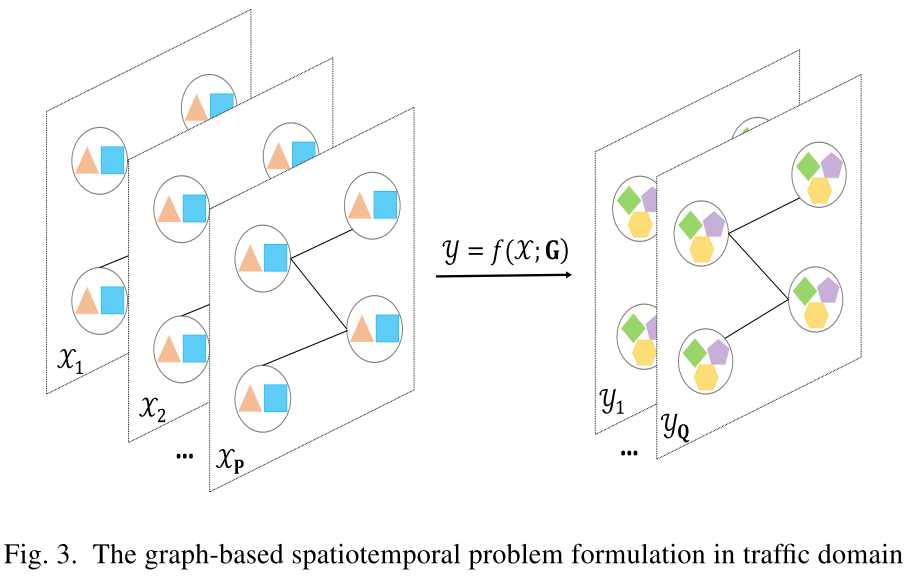
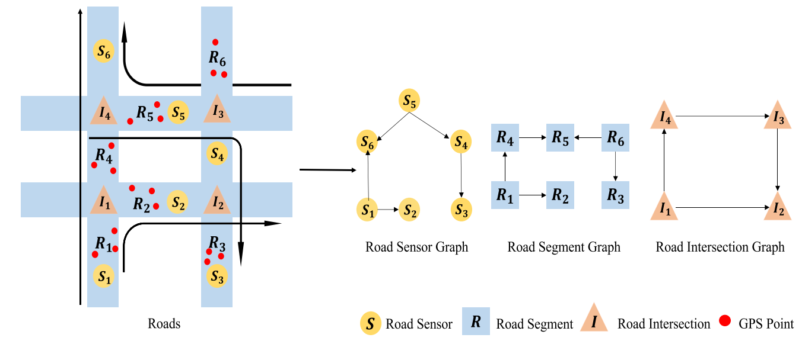

# How-to-Build-a-Graph-Based-Deep-Learning-Architecture-in-Traffic-Domain
Paper：[How to Build a Graph-Based Deep Learning Architecture in Traffic Domain: A Survey](https://arxiv.org/pdf/2005.11691.pdf)

# mind map

# Abstract

深度学习在计算机视觉和自然语言处理方面的巨大成功启发了研究人员在交通领域中利用深度学习技术。已经提出了各种深度学习架构来解决交通领域中的复杂挑战（例如，空间时间依赖性）。此外，研究人员传统上将交通网络建模为空间维度上的网格或分段。但是，许多交通网络本质上都是图结构的。为了充分利用此类空间信息，更合适的方法是将交通网络数学化为图形。最近，已经开发了许多新颖的深度学习技术来处理图形数据。越来越多的作品将这些基于图的深度学习技术应用于各种交通任务，并获得了最先进的性能。为了提供这种新兴趋势的全面清晰的描述，本次调查仔细检查了许多交通应用中各种基于图的深度学习架构。我们首先给出指导方针，以基于图来制定交通问题，并根据各种交通数据构建图。然后，我们分解这些基于图的体系结构，并讨论它们共享的深度学习技术，以阐明每种技术在交通任务中的利用。此外，我们总结了常见的流量挑战以及针对每个挑战的相应的基于图的深度学习解决方案。最后，我们在这个快速发展的领域中提供基准数据集，开源代码和未来的研究方向。

# Introduction

在许多国家和地区，随着城市化进程的不断扩大，大量人口迅速聚集到城市中。这些城市中私家车数量的快速增长和对公共交通服务的需求不断增长，给它们当前的交通系统带来了巨大压力。频繁的交通拥堵，严重的交通事故，长时间的通勤等交通问题严重恶化了旅客的出行体验，降低了城市的运营效率。为了应对这些挑战，许多城市致力于开发智能交通系统（ITS），以提供有效的交通管理，准确的交通资源分配和高质量的交通服务。ITS还旨在减少事故的可能性，缓解交通拥堵并确保公共交通安全。

要构建使城市变得智能的智能交通系统，主要有两个必不可少的要素，即智能基础设施和新算法。

一方面，随着对交通基础设施投资的增加，交通设备和系统越来越多，包括环路探测器，探头，道路网络上的公路摄像机，出租车或公共汽车上的GPS，地铁和公共汽车上的智能卡，自动收费系统，在线乘车或乘车共享系统。这些基础设施是异构数据源，并全天候产生交通数据，例如数字数据（例如GPS轨迹，交通测量），图像/视频数据（例如车辆图像）和文本数据（例如事件报告）。这些运输数据量巨大，细节丰富，结构复杂。迫切需要利用更智能，更强大的方法来处理这些数据。

另一方面，在交通领域，研究人员目睹了从统计方法到机器学习模型以及最近到深度学习方法的进化算法。在早期，包括ARIMA [1]及其变体[2]，VAR [3]，卡尔曼滤波[4]在内的统计方法因其扎实且被广泛接受的数学基础而盛行。但是，这些方法的线性和平稳性假设被交通数据中的高度非线性和动态性所破坏，因此在实践中表现不佳。传统的机器学习方法（例如支持向量机[5]，K最近邻[6]）可以对交通数据中的非线性和更复杂的相关性进行建模。然而，在大数据场景中，这些模型中的浅层架构，手动特征选择和单独学习被认为是不令人满意的[7]。

深度学习在计算机视觉，自然语言处理等许多领域的突破引起了交通行业和研究界的关注。深度学习技术通过提供原始流量数据的端到端学习，克服了手工制作的特征工程。理论上，深度学习方法具有逼近任何复杂功能的强大功能，可以在各种交通网络中对更复杂的模式进行建模。另外，由于可用的计算资源（例如GPU）和足够的交通数据量[7]，基于深度学习的技术已被广泛采用，并在多种交通应用中实现了最先进的性能。递归神经网络（RNN）及其变体被广泛用于处理序列数据，并且具有提取交通数据中时间相关性的出色能力[8]。但是，它们无法提取交通网络的空间特征。卷积神经网络（CNN）是在基于网格的交通网络中建模空间依赖性的强大方法[9]。然而，许多交通数据自然是基于图形的数据。更糟糕的是，CNN专注于提取局部相关性，而忽略整个网络的全局连接。另外，尽管一些先前的工作已经在图形视图中分析了交通问题[10]，[11]，[12]，但是这些传统方法还不足以处理大数据并解决复杂的挑战。

最近，许多研究扩展了对图数据的深度学习方法[13]，并提出了一组称为图神经网络（GNN）的神经网络[14]，[15]，[16]，旨在解决与图相关的应用。GNN已成为许多领域的最新方法，包括自然语言处理[17]，计算机视觉[18]，生物学[19]，推荐系统[20]。由于许多交通数据都是图结构的，因此在交通领域中探索热门和有效的GNN可以提高预测准确性是很自然的。在过去的几年中，已经制作了许多作品，并且还有更多作品正在路上。在这种情况下，在运输领域对这些基于图的深度学习体系结构进行全面的文献综述是非常及时的，这正是我们的工作。

据我们所知，这是第一篇针对流量领域基于图的深度学习作品进行全面调查的论文。请注意，我们审查的某些作品实际上是使用相似技术解决相似交通问题的。我们的总结可以帮助即将来临的研究人员避免重复的工作，而专注于新的解决方案。此外，本次调查中实用且明确的指南使参与者可以将这些新兴方法快速应用于现实交通任务中。

总而言之，我们做出了如下重要贡献：

- 我们系统地概述了一些交通问题，相关的研究方向和挑战，以概述交通领域，从而帮助参与者找到或扩展他们的研究。
- 我们总结了时空交通问题的一般表述，并为构建四种原始交通数据集的图提供了具体的指导。如此全面的总结非常实用，可以加速基于图的方法在流量域中的应用。
- 我们分析了五种深度学习技术（例如GNN），这些技术广泛用于基于图的交通工作中。我们简要介绍了这些技术的理论方面，优势，局限性，并在特定的交通任务中详细阐述了它们的变体，以期激发以下研究人员开发更多新颖的模型。
- 我们详细讨论了许多基于图结构的交通任务面临的四个常见挑战。对于每个挑战，我们总结了多个基于深度学习的解决方案并进行必要的比较，这对于交通任务中的模型选择可能是有用的建议。
- 我们在相关论文中收集基准数据集和开放源代码，以促进该领域的基准实验。最后，我们提出了未来的研究方向。

本文的其余部分安排如下。第2节介绍了流量领域的其他调查以及有关图神经网络的一些概述。第3节介绍了一些交通问题以及相应的研究方向，挑战。第4节总结了有关交通问题和交通数据集的图形构造。第5节分析了GNN和其他深度学习技术的核心功能，优点和缺点，并研究了为特定交通任务创建这些技术的新颖变体的技巧。第6节讨论了流量域中的常见挑战以及相应的多种解决方案。第7节提供了相关研究论文中开放代码和数据集的超链接。第8节介绍了未来的方向。第9节总结了论文。

# Related Work

已经有一些调查从不同的角度总结了流量域中不断发展的算法。[21]讨论了统计方法和神经网络之间的异同，以促进这两个社区之间的理解。[22]回顾了短期交通预测的十大挑战，这些挑战源于ITS应用需求的变化。[23]对城市流量预测的方法进行了全面的概述。[7]基于深度学习（DL）提供了城市大数据融合方法的分类：基于DL输出的融合，基于DL输入的融合和基于DL双阶段的融合。[24]，[25]讨论了针对热门主题的深度学习，包括交通网络表示，交通流量预测，交通信号控制，自动车辆检测。[26]和[27]对多种交通应用中新兴的深度学习模型进行了类似但更详尽的分析。[28]提供了一个时空视角来总结交通领域和其他领域的深度学习技术。但是，所有这些调查都没有考虑图神经网络（GNN）的相关文献，只是[28]只是在很短的小节中提到了GNN。

另一方面，也有一些评论总结了w.r.t.GNN在不同方面。[29]率先概述了在非欧几里德空间中处理数据（例如图形数据）的深度学习技术。[30]按图类型，传播类型和训练类型对GNN进行了分类，并将相关应用分为结构方案，非结构方案和其他方案。[31]分别介绍了基于小图和巨图的GNN。[32]，[31]集中于审查GNN特定分支（即图卷积网络（GCN））中的相关工作。但是，他们很少介绍与交通场景相关的GNN。[33]是唯一花费一个段落描述流量域GNN的调查，对于任何想要探索该领域的人来说，这显然是不够的。

到目前为止，仍然缺乏系统的，详尽的调查来探索交通领域中发展迅速的基于图的深度学习技术。我们的工作旨在填补这一空白，以增进对交通运输界新兴技术的理解。

# Problems, Research Directions and Challenges

在本节中，我们简要介绍交通领域的背景知识，包括一些重要的交通问题和研究方向（如图1所示），以及在这些问题下的常见挑战。一方面，我们认为，如此简洁而系统的介绍可以帮助读者快速理解这一领域。另一方面，我们的调查显示，与基于图的深度学习技术相关的现有作品仅涵盖了一些研究方向，这激发了后继者将类似技术转移到其余方向。

## Traffic Problems

运输社区打算解决许多问题，包括缓解交通拥堵，满足旅行需求，加强交通管理，确保运输安全，实现自动驾驶。每个问题都可以分为几个研究方向，而某些方向可以解决多个问题。我们将介绍这些问题及其研究方向。

### Traffic Congestion

交通拥挤[34]是现代城市中最重要，最紧迫的问题之一。扩展道路基础设施的解决方案非常昂贵且耗时。更实际的方法是提高交通效率，例如，预测道路网络上的交通拥堵[35]，[36]，通过交通状态预测[37]，[18]控制路况，优化车辆通过控制交通信号[38]，[39]来优化及通流量。

### Travel Demand

出行需求是指市民对交通服务（出租车，自行车，公共交通工具）的需求。随着在线乘车平台（例如Uber，DiDi）的出现以及公共交通系统（例如地铁系统和公共汽车系统）的快速发展，从许多角度来看，旅行需求预测变得越来越重要。对于相关机构来说，它可以帮助更好地分配资源，例如在高峰时段增加地铁频率，为服务热点增加更多公交车。对于商业部门，它使他们能够更好地管理出租车出租[40]，拼车[41]，自行车共享服务[42]，[43]，并最大限度地提高收入。对于个人，它鼓励用户考虑各种交通工具，以减少通勤时间并改善出行体验。

### Transportation Safety

运输安全是公共安全必不可少的部分。交通事故会造成长时间的延误，并造成受害者受伤甚至死亡。因此，监控交通事故和评估交通风险对于避免财产损失和挽救生命至关重要。许多研究关注方向，例如检测交通事故[44]，根据社交媒体数据预测交通事故[45]，预测其风险水平[46]，预测交通事故的伤害严重程度[47]，[48]。

### Traffic Surveillance

如今，监视摄像机已广泛部署在城市道路上，生成大量图像和视频[27]。这种发展增强了交通监控，其中包括交通执法，自动收费系统[49]和交通监控系统。交通监控的研究方向包括车牌检测，自动车辆检测[50]，行人检测[51]。5）

### Autonomous Driving

自动驾驶是代表未来的关键新兴产业。自主驾驶要求以平稳准确的方式识别树木，道路和行人。许多任务与视觉识别有关。自动驾驶的研究方向包括车道和车辆检测[52]，[53]，行人检测[54]，交通标志检测。

## Research Directions

我们对交通领域基于图的深度学习的调查显示，现有工作主要集中在两个方向，即交通状态预测，乘客需求预测，还有一些工作集中在驾驶员行为分类[55]，最佳DETC方案[49]，车辆/人员轨迹预测[56]，[57]，路径可用性[58]，交通信号控制[59]。据我们所知，尚未基于图形视图探索交通事故检测和车辆检测

### Traffic State Prediction

文献中的交通状态是指交通流量，交通速度，出行时间，交通密度等。交通流量预测（TFP）[60]，[61]，交通速度预测（TSP）[62]，[63]，行驶时间预测（TTP）[64]，[65]是交通状态预测的热门分支，其中吸引了深入的研究。

### Travel Demand Prediction

出行需求预测旨在估计需要交通服务的用户的未来数量，例如，预测城市每个区域的未来出租车需求[66]，[67]或预测地铁系统中车站级别的乘客需求[68]，[69]，或预测全市的自行车租赁需求[42]，[43]。

### Traffic Signal Control

从长远来看，交通信号灯控制应适当地控制交通信号灯，以减少车辆在十字路口的停留时间[25]。交通信号控制[59]可以优化交通流量并减少交通拥堵和排放。

### Drivers Behaviors Classifying

随着车载传感器和GPS数据的可用性，对驾驶员的驾驶方式进行自动分类是一个有趣的研究问题。驾驶特征的高维度表示有望为自动驾驶和汽车保险行业带来更高收益。

### Traffic Incident Detection

重大事件可能会对旅行者造成致命伤害，并导致道路网络长时间延误。因此，了解事故的主要原因及其对交通网络的影响对于现代交通管理系统至关重要[44]。

### Vehicle Detection

自动车辆检测旨在处理从固定摄像机在道路上记录的视频，然后将视频传输到监视中心进行记录和处理。

## Challenge

尽管交通问题及其研究方向是多种多样的，但它们也面临一些共同的挑战，即空间依赖性，时间依赖性和外部因素。

例如，在早上高峰时间主要道路上发生交通拥堵时，交通流量将在接下来的几个小时改变。而且，其相邻道路可能很快就会出现交通阻塞[70]，[71]，[72]。在车辆轨迹预测中，周围车辆的随机行为，邻居的相对位置以及自身轨迹的历史信息是影响预测性能的因素[56]。在预测某个地区的乘车需求时，其先前的订单对于预测至关重要。另外，共享相似功能的区域可能会在出租车需求中共享相似模式[73]，[66]，[67]。为了预测交通信号，要考虑道路网络上多个路口的几何特征以及之前的交通流量[59]。

为了解决上述挑战，许多作品提供了各种解决方案，这些解决方案可以分为统计方法，传统机器学习方法，深度学习技术。在本文中，我们专注于流量领域的深度学习技术。与之前的深度学习相关流量调查不同，我们对如何构建基于图的深度学习架构以克服各种任务中的挑战感兴趣。我们研究了相关交通工作提供的许多基于图的解决方案，并总结了解决上述挑战的通用技术（如图2所示）。

在以下各节中，我们首先介绍解决交通问题的常用方法，并提供详细的准则，以根据交通数据构建交通图。然后，我们从两个角度（即技术角度和挑战角度）阐明挑战与技术之间的相关性。在技术角度，我们介绍了几种常用技术，并解释了它们如何应对交通任务中的挑战。从挑战的角度出发，我们详细阐述了每个挑战，并总结了可以解决该挑战的技术。总之，我们希望结合深度学习技术从图的视角提供解决交通问题的见解。

# Problem Formulation and Graph Construction

在我们研究的基于图的深度学习交通文献中，超过80％的任务本质上是基于图的空间时间预测问题，尤其是交通状态预测，旅行需求预测。在本节中，我们首先列出常用的符号。然后，我们总结了交通领域中基于图的时空预测的一般表述，并提供了从各种交通数据集构建图的细节。最后，我们讨论邻接矩阵的多种定义，它们代表了交通网络的图拓扑，并且是基于图的解决方案的关键要素。

## Notations

在本文中，我们表示了图相关的元素，变量，参数（超参数或训练参数），激活函数和其他操作。变量由输入变量$\{x, X, \mathbf{x}, \mathbf{X}, \mathcal{X}\}$和输出变量组成$\{y, Y, \mathbf{y}, \mathbf{Y}, \mathcal{Y}\}$。这些变量可以分为三类。第一组由仅代表空间属性的空间变量组成。第二组由仅代表时间属性的时间变量组成。最后一组由代表空间和时间特征的时空变量组成。

## Graph-based Spatial Temporal Forecasting To

据我们所知，大多数现有的基于图的深度学习交通工作可以归类为空间时间预测。尽管数学符号不同，但他们以非常相似的方式形式化了他们的预测问题。我们总结了他们的工作，为交通领域中许多基于图的时空问题提供了一般的表述。
交通网络用图形$G=(V,E,A)$表示，可以按有针对性地加权[74]，[64]，[60]或不加权[58]，[70]，[75], 有向图[58]，[76]，[77]或无向图[74]，[61]，[78]，具体取决于具体任务。$V$是一组节点，$|V|= N$表示图中的$N$个节点。每个节点代表一个交通对象，可以是传感器[62]，[61]，[79]，路段[74]，[80]，[81]，路口[64]，[76]，甚至是GPS交叉路口[60]。$E$是一组边，表示节点之间的连接性。

$\mathbf{A}=\left(\mathbf{a}_{i j}\right)_{\mathbf{N} \times \mathbf{N}} \in \mathbb{R}^{\mathbf{N} \times \mathbf{N}}$是包含交通网络拓扑信息的邻接矩阵，对交通预测很有用。矩阵$A$中的项$a_{ij}$表示节点接近度，并且在各种应用程序中有所不同。它可以是二进制值0或1 [61]，[70]，[75]。具体而言，0表示节点$i$和节点$j$之间没有边缘，而1表示这两个节点之间的边缘。它也可以是表示节点[74]，[73]之间某种关系的浮点值，例如，两个传感器[62]，[82]，[77]之间的道路距离。

$\mathcal{X}_{t}=\left[\mathcal{X}_{t}^{1}, \cdots, \mathcal{X}_{t}^{i}, \cdots, \mathcal{X}_{t}^{\mathrm{N}}\right] \in \mathbb{R}^{\mathrm{N} \times \mathbf{F}_{\mathrm{I}}}$是时刻$t$整个图的特征矩阵。$X_i^t \in R^{F_I}$表示在时间$t$具有$F_I$特征的节点$i$。这些功能通常是交通指标，例如交通流量[78]，[77]，交通速度[62]，[80]，[76]或rail-hail orders[74]，[73]，客流[68]]，[69]。通常，连续指标会在数据预处理阶段进行标准化。

给定整个过去P个时间段内的交通网络的历史观测值，表示为$\left[\mathcal{X}_{1}, \cdots, \mathcal{X}_{i}, \cdots, \mathcal{X}_{\mathbf{P}}\right] \in \mathbb{R}^{\mathbf{P} \times \mathbf{N} \times \mathbf{F}_{\mathbf{I}}}$，交通领域的时空预测问题旨在预测下一个Q时间片的未来交通情况，表示为$\mathcal{Y}=\left[\mathcal{Y}_{1}, \ldots, \mathcal{Y}_{i}, \ldots, \mathcal{Y}_{\mathrm{Q}}\right] \in \mathbb{R}^{\mathrm{Q} \times \mathrm{N} \times \mathrm{F}_{\mathrm{O}}}$，其中$\mathcal{Y}_t \in \mathbb{R}^{N \times F_o}$表示在时间$t$具有$F_O$特征的输出图。

该问题（如图3所示）可以表述为：
$$
\mathcal{Y}=f(\mathcal{X} ; \mathbf{G}) \tag{1}
$$
一些工作预测未来多个交通指标（即$F_O> 1$），而另一些作品预测一个交通指标（即$F_O = 1$），例如交通速度[80]，[76]，rail-hide orders[74]，[73]。有些作品只考虑了单步预测[83]，[66]，[49]，即预测下一时间步的交通状况，即$Q =1$。但是为单步预测而设计的模型不能直接应用于预测多步，因为它们是通过减少在训练阶段的错误而不是后续时间步骤来优化的[67]。许多工作着重于多步预测（即$Q> 1$）[84]，[18]，[85]。根据我们的调查，主要有三种产生多步输出的技术，即FC层，Seq2Seq，膨胀技术。全连接（FC）层是最简单的技术，它是获得所需输出形状的输出层[62]，[61]，[86]，[70]，[87]，[88]。一些作品采用基于序列的序列（Seq2Seq）体系结构和基于RNN的解码器，通过多个步骤[89]，[79]，[71]，[84]，[90]，[77]递归生成输出。[82]，[85]采用膨胀技术来获得所需的输出长度。

此外，有些作品不仅考虑了与交通相关的测量，而且还考虑了外部因素（例如时间属性，天气）[62]，[91]，[87]，[92]。因此，问题的表述变为：
$$
\mathcal{Y}=f(\mathcal{X}, \mathcal{E} ; \mathbf{G})  \tag{2}
$$
其中 $\mathcal{E}$ 代表外部因素.

## Graph Construction from Traffic Datasets

将交通网络建模为图形对于任何打算利用基于图形的深度学习架构的工作都至关重要。即使许多工作都有类似的问题表述，但由于它们收集的交通数据集，它们在图形构造上也有所不同。我们发现，根据相关的交通基础设施，这些数据集可以分为四类：道路网络上的传感器数据[62]，[61]，[63]，出租车的GPS轨迹[60]，[93]，[76]，订单轨道交通系统[73]，[67]，[92]，地铁[68]，[69]或公交系统[93]的交易记录。对于每种类别，我们描述数据集并解释交通图$G$中节点$V$，边$E$，特征矩阵$X_t$的构造。

### Sensors Datasets

交通测量值（例如，行车速度）通常由传感器（例如，环路检测器，探头）每30秒钟收集一次。例如北京[74]，加利福尼亚[63]，洛杉矶[62]，纽约[80]，费城[86]，西雅图[75]，厦门[79]和华盛顿[86]等大城市的道路网络。传感器数据集是现有作品中最流行的数据集，尤其是加利福尼亚州的PEMS数据集。通常，道路网络包含交通对象，例如传感器，路段（如图4所示）。一些现有的作品构建了一个传感器图[62]，[61]，[77]，而另一些则构建了一个路段图[74]，[80]，[86]。

图4.交通数据集的图形构造：1）在传感器图中，传感器代表节点，并且在道路同一侧的相邻传感器之间有一条边。传感器的特征是交通量度可以自行校正。2）在路段图中，路段代表节点，两个相连的路段具有边。在传感器数据集中，路段的特征是其上所有传感器记录的平均交通测量值（例如，交通速度）。在GPS数据集中，每个路段的特征是该路段上所有GPS点记录的平均路况测量值。3）在道路交叉点图中，道路交叉点表示节点，并且通过路段连接的两个道路交叉点具有边。路段的特征是通过路段的交通量的总和。大多数作品将边缘方向视为交通流的方向[62]，[79]，[58]，[77]，[60]，[93]，而有些作品则忽略了方向，并构造了无向图[61]，[82]，[75] [81]，[76]。

### GPS Datasets

GPS轨迹数据集通常由一段时间内的出租车数量生成，例如北京[60]，成都[60]，深圳[70]，科隆[76]和芝加哥[81]。每辆出租车每天都会产生大量带时间，空间和速度信息的GPS点。每个GPS记录都适合城市路线图上最近的道路。通过道路交叉口，所有道路均分为多个路段。一些作品提取了道路线段图[81]，[70]，而另一些作品提取了道路交叉口图[64]，[60]，[76]（如上图4所示）。

### Rail-hailing Datasets

这些数据集记录了一段时间内北京[74]，[73]，成都[73]和上海[74]等城市的汽车/出租车/自行车需求订单。具有OpenStreetMap的目标城市被划分为等大小的基于网格的区域。每个区域都定义为图中的一个节点。每个节点的特征是在给定间隔内其区域内的订单数。[74]，[73]观察到节点之间的各种相关性对于预测是有价值的，并且构建了多个图（如图5所示）。

图5. 多重关系：1）空间局部性图：此图基于空间邻近性，并且在3 x 3的网格中构造区域及其8个相邻区域之间的边缘。2）交通运输连通性图：该图假定地理上相距遥远但可以通过高速公路，高速公路或地铁方便到达的区域与目标区域具有很强的相关性。它们之间应该有边缘。3）功能相似度图：此图假定共享相似功能的区域可能具有相似的需求模式。在具有类似周围POI的区域之间构造边缘。

### Transactions Datasets

这些数据集是从地铁或公交交易系统生成的，可以从中构建地铁图[68]，[69]，[93]或公交图[93]。

地铁图：地铁系统中的每个站都被视为一个节点。如果地铁线路的两个站点相邻，则它们之间会有一条边缘，反之亦然。工作站的功能通常是给定时间间隔内的流入和流出记录。

公交车图：每个公交车站都被视为一个节点。如果公交线路中的两个公交车站相邻，则它们之间会有一条边缘，反之亦然。公交车站的特征通常是给定时间间隔内的入口记录以及其他特征。

## Adjacency Matrix

邻接矩阵$\mathbf{A}=\left(\mathbf{a}_{i j}\right)_{\mathbf{N} \times \mathbf{N}} \in \mathbb{R}^{\mathbf{N} \times \mathbf{N}}$是提取交通图拓扑的关键元素，对预测具有重要意义。元素$a_{ij}$（二进制或加权）表示节点之间的异构成对关系。但是，根据交通场景中的不同假设，可以采用非常不同的方式来设计矩阵，例如固定矩阵和动态矩阵。

### Fixed Matrix

许多工作都假设节点之间的相关性是基于一些先验知识而固定的，并且不会随时间变化。因此，设计了一个固定的矩阵，并且在整个实验过程中保持不变。另外，一些工作提取了节点之间的多个关系，从而产生了多个固定矩阵[57]，[43]。通常，预定义的矩阵表示交通网络中的空间依赖性，而在某些工作中，它还捕获其他种类的相关性，例如功能相似性和运输连通性[74]，语义连接[73]，时间相似性[63]。对于条目值$a_ij$，在某些作品[61]，[86]，[70]，[75]中定义为1（连接）或0（断开）。在许多其他著作中，它被定义为节点[64]，[60]，[81]，[78]，[67]，[76]之间的距离的函数。[74]，[62]，[91]，[79]，[82]，[77]。他们使用阈值高斯核定义$a_{ij}$如下：
$$
\mathbf{a}_{i j}=\left\{\begin{array}{l}
\exp \left(-\frac{\mathbf{d}_{i j}^{2}}{\sigma^{2}}\right), i \neq j \text { and } \mathbf{d}_{i j} \geq \epsilon \\
0 \quad, i=j \text { or } \mathbf{d}_{i j}<\epsilon
\end{array}\right. \tag{3}
$$
其中$d_{ij}$是节点$i$与节点$j$之间的距离。超参数$σ^2$和$\epsilon$是控制矩阵A分布和稀疏性的阈值。

### Dynamic Matrix

一些工作认为，由于有缺陷的先验知识或不完整的数据，预定义的矩阵不一定反映节点之间的真正依赖性[64]。提出了一种新颖的自适应矩阵，并通过节点嵌入来学习。[82]，[64]，[80]中的实验证明，自适应矩阵可以精确地捕获数据中隐藏的空间依赖性。

在某些情况下，图结构可能会随着时间的推移而演变，因为某些边缘可能变得不可用，例如道路拥堵或封闭，并在缓解拥塞后又变得可用。不断发展的拓扑结构[58]被纳入模型以捕获这种动态空间变化。

# Deep Learning Techniques Perspective

我们总结了现有交通文献中的许多基于图的深度学习架构，发现它们大多数由图神经网络（GNN）和其他模块组成，例如递归神经网络（RNN），时间卷积网络（TCN），序列到序列（Seq2Seq）模型，生成对抗网络（GAN）（如表II所示）。正是GNN与其他深度学习技术的合作才能在许多交通场景中实现最先进的性能。本部分旨在介绍其在交通任务中的原理，优点，缺陷及其变体，以帮助参与者了解如何在交通领域中利用深度学习技术。

## [GNNs](#content)

在过去的两年中，受深度学习方法（例如CNN，RNN）的巨大成功的激励，人们越来越有兴趣将神经网络泛化为任意结构化的图，并且这种网络被归类为图神经网络。许多工作着重于扩展CNN用于图数据的卷积，并且图上的新型卷积已得到迅速发展。与交通任务相关的两个主流图卷积是无向图的谱图卷积（SGC）和有向图的扩散图卷积（DGC）。也有其他新颖的卷积[60]，但相关的流量工作相对较少。SGC和DGC都旨在通过特征聚合和非线性变换为图中的每个节点生成新的特征表示（如图6所示）。请注意，我们将SGC网络称为SGCN，将DGC网络称为DGCN。

图6：图神经网络的一般结构由两层组成：1）聚合层：在每个特征维上，相邻节点的特征被聚合到中心节点。在数学上，聚合层的输出是邻接矩阵和特征矩阵的乘积。2）非线性变换层：随后，每个节点的所有聚合特征都被馈送到非线性变换层中以创建更高的特征表示。所有节点共享相同的转换内核。

### [Spectral Graph Convolution](#content)

在频谱理论中，图由其对应的归一化拉普拉斯矩阵$\mathbf{L}=\mathbf{I}_{\mathrm{N}}-\mathbf{D}^{-\frac{1}{2}} \mathbf{A} \mathbf{D}^{-\frac{1}{2}} \in \mathbb{R}^{\mathbf{N} \times \mathbf{N}}$表示。实对称矩阵$L$可以通过特征分解对角化，如$\mathbf{L}=\mathbf{U} \mathbf{\Lambda} \mathbf{U}^{T}$，其中$\mathbf{U} \in \mathbb{R}^{\mathbf{N} \times \mathbf{N}}$是特征向量矩阵，而$\boldsymbol{\Lambda} \in \mathbb{R}^{\mathbf{N} \times \mathbf{N}}$是对角特征值矩阵。由于$U$也是正交矩阵，[99]将其用作图傅立叶基础，将图信号$x \in \mathbb{R}^{\mathbf{N}}$的图傅里叶变换定义为$\hat{x}=\mathbf{U}^{T} x$，其逆取为$x=\mathbf{U} \hat{x}$。

[100]尝试将CNN卷积的类似物建立到光谱域中，并将光谱卷积定义为$y=\Theta *_{\mathcal{G}} x=\mathbf{U} \Theta \mathbf{U}^{T} x$，将$x$转换为光谱域，通过对角核调整其振幅$\Theta=\operatorname{diag}\left(\theta_{0}, \ldots, \theta_{\mathbf{N}-1}\right) \in \mathbb{R}^{\mathbf{N} \times \mathbf{N}}$，并进行傅立叶逆变换以获得空间域中的最终结果$y$。尽管从理论上保证了这种卷积，但在计算上是昂贵的，因为与$U$的乘积为$O(N^2)$，而$L$的本征分解对于大规模图形是无法接受的。此外，它会使用$N$个参数以内核$\theta$考虑所有节点，因此无法提取空间定位。

为避免这种局限性，[101]通过限制内核$\theta$为特征值矩阵$\boldsymbol{\Lambda}$的多项式来局限卷积并减少其参数，因为$\Theta=\sum_{k=0}^{K-1} \theta_{k} \Lambda^{k}$，而$K$从a确定卷积的最大半径中央节点。因此，可以将卷积改写为：$\Theta *_{\mathcal{G}} x=\sum_{k=0}^{K-1} \theta_{k} \mathbf{U} \mathbf{\Lambda}^{k} \mathbf{U}^{T} x=\sum_{k=0}^{\mathbf{K}-1} \theta_{k} \mathbf{L}^{k} x$。更进一步，[101]采用Chebyshev多项式$T_k(x)$逼近$L^k$，得到$\Theta *_{\mathcal{G}} x \approx \sum_{k=0}^{K-1} \theta_{k} T_{k}(\tilde{\mathbf{L}}) x$，重定比例为$\tilde{\mathbf{L}}=\frac{2}{\lambda_{\max }} \mathbf{L}-\mathbf{I}_{\mathbf{N}}$，$λ_{max}$是$L$的最大特征值，$T_{k}(x){=} 2 x T_{k-1}(x)-T_{k-2}(x), T_{0}(x)=1$,$T1(x) = x$ [102]。通过递归计算$Tk(x)$，可以将此K-localized卷积的复杂度降低为$\mathcal{O}(\mathbf{K}|\mathbf{E}|)$，其中$|\mathbf{E}|$是边的数量。

基于[101]，[103]，通过限制$K = 2$简化了频谱图卷积，并且在$T_0(\tilde{\mathbf{L}})= 1$的情况下，$T_1(\tilde{\mathbf{L}})=\tilde{\mathbf{L}}$，他们得到$\Theta *_{\mathcal{G}} x \approx \theta_{0} T_{0}(\tilde{\mathbf{L}}) x+\theta_{1} T_{1}(\tilde{\mathbf{L}}) x=\theta_{0} x+\theta_{1} \tilde{\mathbf{L}} x$。注意到$\tilde{\mathbf{L}}=\frac{2}{\lambda_{\max }} \mathbf{L}-\mathbf{D}$，他们将$λ_{max}= 2$设置为$\Theta *_{\mathcal{G}} x \approx \theta_{0} x+\theta_{1}(\mathbf{L}-\mathbf{D}) x$。对于该$\mathbf{I}_{\mathrm{N}}-\mathbf{D}^{-\frac{1}{2}} \mathbf{A} \mathbf{D}^{-\frac{1}{2}}$ 和 $\mathbf{L}=\mathbf{L}-\mathbf{I}_{\mathrm{N}}=-\mathbf{D}^{-\frac{1}{2}} \mathbf{A} \mathbf{D}^{-\frac{1}{2}}$，它们得到$\Theta *_{\mathcal{G}} x \approx \theta_{0} x-\theta_{1}\left(\mathbf{D}^{-\frac{1}{2}} \mathbf{A} \mathbf{D}^{-\frac{1}{2}}\right) x$。此外，他们通过设置$θ=θ_0=-θ_1$来解决过度拟合，从而减少了参数数量，并得到$\Theta *_{\mathcal{G}} x \approx \theta\left(\mathbf{I}_{\mathrm{N}}+\mathbf{D}^{-\frac{1}{2}} \mathbf{A} \mathbf{D}^{-\frac{1}{2}}\right) x$。他们进一步定义$\mathbf{A}=\mathbf{A}+\mathbf{I}_{\mathbf{N}}$，并采用重归一化技巧，得到$y=\Theta *_{G} x \approx \theta \tilde{\mathbf{D}}^{-\frac{1}{2}} \tilde{\mathbf{A}} \tilde{\mathbf{D}}^{-\frac{1}{2}} x$，其中$\tilde{\mathbf{D}}$是$\tilde{\mathbf{A}}$的度矩阵。最后，[103]提出了频谱图卷积层为：
$$
\begin{aligned}
Y_{j} &=\rho\left(\Theta_{j} *_{\mathcal{G}} X\right) \\
&=\rho\left(\sum_{i=1}^{\mathbf{F}_{\mathrm{I}}} \theta_{i, j} \tilde{\mathbf{D}}^{-\frac{1}{2}} \tilde{\mathbf{A}} \tilde{\mathbf{D}}^{-\frac{1}{2}} X_{i}\right), 1 \leq j \leq \mathbf{F}_{\mathrm{O}} \\
Y &=\boldsymbol{\rho}\left(\tilde{\mathbf{D}}^{-\frac{1}{2}} \tilde{\mathbf{A}} \tilde{\mathbf{D}}^{-\frac{1}{2}} X W\right)
\end{aligned} \tag{4}
$$
